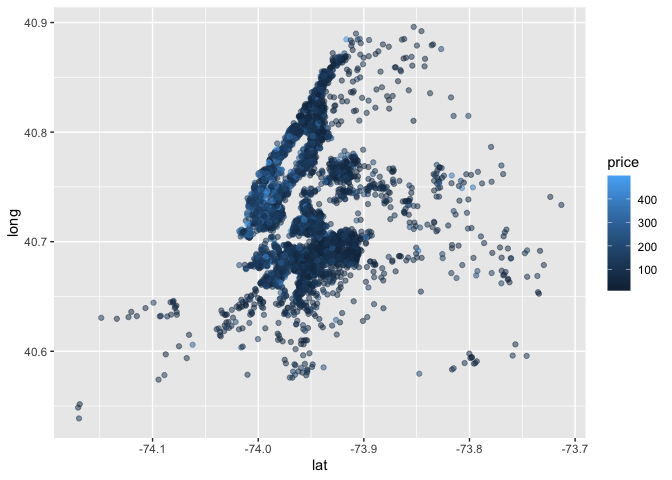

case study
================
Kaila Boyer
10/14/2021

``` r
library(tidyverse)
```

    ## ── Attaching packages ─────────────────────────────────────── tidyverse 1.3.1 ──

    ## ✓ ggplot2 3.3.5     ✓ purrr   0.3.4
    ## ✓ tibble  3.1.4     ✓ dplyr   1.0.7
    ## ✓ tidyr   1.1.3     ✓ stringr 1.4.0
    ## ✓ readr   2.0.1     ✓ forcats 0.5.1

    ## ── Conflicts ────────────────────────────────────────── tidyverse_conflicts() ──
    ## x dplyr::filter() masks stats::filter()
    ## x dplyr::lag()    masks stats::lag()

``` r
library(p8105.datasets)
```

## Load Data

``` r
data(nyc_airbnb)
```

-   is the price correlated with review score?
-   which neighborhood is most popular? Most expensive?
-   which neighborhood has the highest reviews?
-   is availability related to price?
-   is room type related to neighborhood?
-   is length of stay related to neighborhood group (borough)?

``` r
nyc_airbnb <- 
  nyc_airbnb %>% 
  mutate(stars = review_scores_location / 2) %>% 
  rename(borough = neighbourhood_group)


nyc_airbnb %>%  
  count(borough, room_type) %>%  
  pivot_wider(
    names_from = room_type, 
    values_from = n 
  )
```

    ## # A tibble: 5 × 4
    ##   borough       `Entire home/apt` `Private room` `Shared room`
    ##   <chr>                     <int>          <int>         <int>
    ## 1 Bronx                       192            429            28
    ## 2 Brooklyn                   7427           9000           383
    ## 3 Manhattan                 10814           7812           586
    ## 4 Queens                     1388           2241           192
    ## 5 Staten Island               116            144             1

``` r
nyc_airbnb %>%  janitor::tabyl(borough, room_type)
```

    ##        borough Entire home/apt Private room Shared room
    ##          Bronx             192          429          28
    ##       Brooklyn            7427         9000         383
    ##      Manhattan           10814         7812         586
    ##         Queens            1388         2241         192
    ##  Staten Island             116          144           1

price and room type

``` r
nyc_airbnb %>%
  ggplot(aes( x= stars, y = price)) +
  geom_point() + 
  facet_grid(.~ room_type)
```

    ## Warning: Removed 10037 rows containing missing values (geom_point).

<!-- -->

price and neighborhood

``` r
nyc_airbnb %>% 
  group_by(neighbourhood) %>% 
  summarise(mean_price = mean(price, na.rm =T)) %>% 
  arrange(mean_price)
```

    ## # A tibble: 217 × 2
    ##    neighbourhood     mean_price
    ##    <chr>                  <dbl>
    ##  1 Little Neck             41.7
    ##  2 Schuylerville           42.6
    ##  3 Morris Heights          47.6
    ##  4 Mount Eden              49.3
    ##  5 Soundview               50.6
    ##  6 Claremont Village       51.6
    ##  7 Hunts Point             52.2
    ##  8 Baychester              54  
    ##  9 Rosebank                55  
    ## 10 Belmont                 55.4
    ## # … with 207 more rows

``` r
nyc_airbnb %>% 
  filter(borough == "Manhattan", 
         price <= 1000) %>%  
  mutate(neighbourhood = fct_reorder(neighbourhood, price)) %>% 
  ggplot(aes(x = neighbourhood, y = price)) + 
  geom_boxplot() + 
  coord_flip() + 
  facet_grid(.~ room_type)
```

<!-- -->

price vs. location

``` r
nyc_airbnb %>%  
  filter(price < 500) %>% 
  sample_n(5000) %>% 
  ggplot(aes(x = lat, y = long, color = price)) +
  geom_point(alpha = 0.5) 
```

<!-- -->

## rety leaflet

``` r
library(leaflet)

nyc_airbnb %>% 
  filter(price < 500) %>% 
  sample_n(1000) %>% 
  leaflet() %>%  
  addTiles() %>%  
  addMarkers(~lat, ~long) 

nyc_airbnb %>% 
  filter(price < 500) %>% 
  sample_n(1000) %>% 
  leaflet() %>%  
  addProviderTiles(providers$CartoDB.Positron) %>%  
  addMarkers(~lat, ~long) 
```
